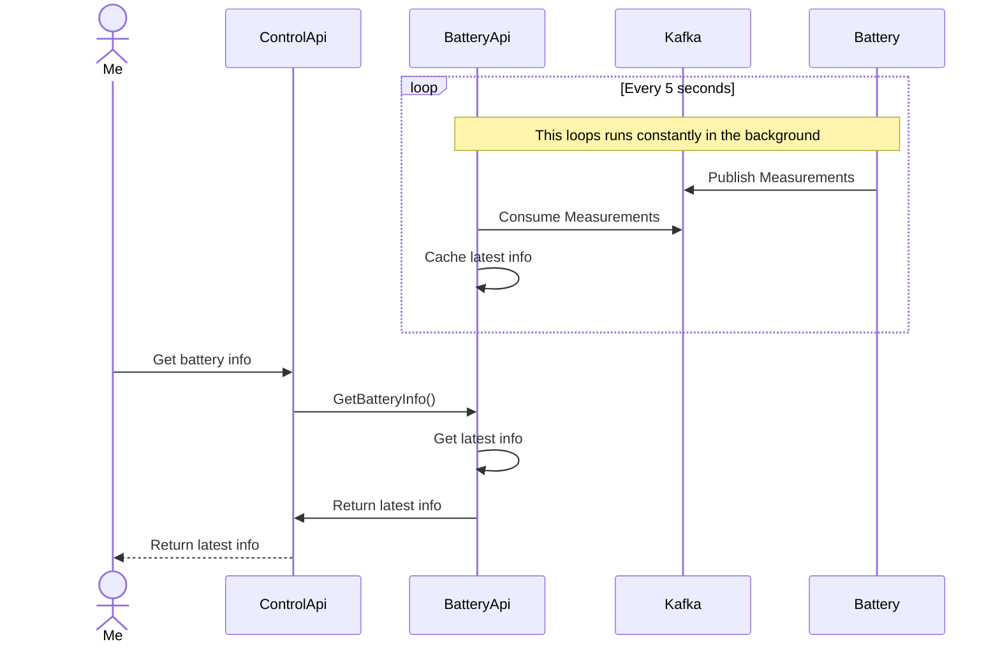
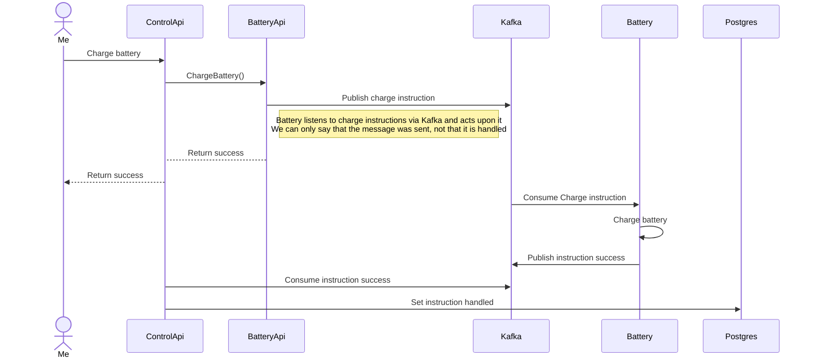
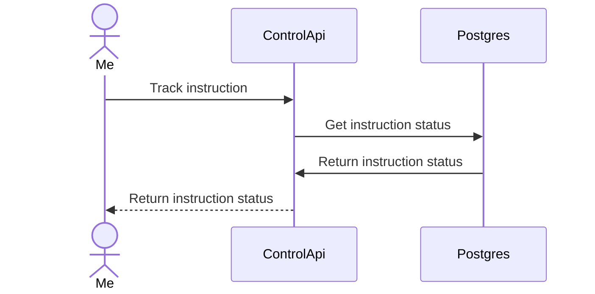

# OTEL Workshop App

## Setup

1. Run `npm install` to install all dependencies
2. Run the docker-compose by running: `docker-compose -p otel-workshop -f docker/docker-compose.yml up -d`
3. Prepare the database: `npm run db:prepare`
4. Run all apps: `npm run all`
5. Go to the API: [http://localhost:3001/api](http://localhost:3001/api)

## Application flows

**Get battery info**

**Dis(charge) battery**

**Track instruction**

