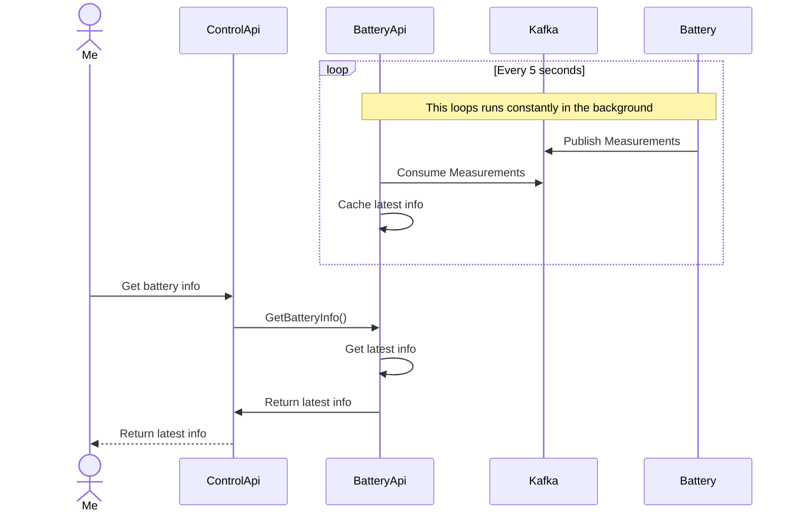
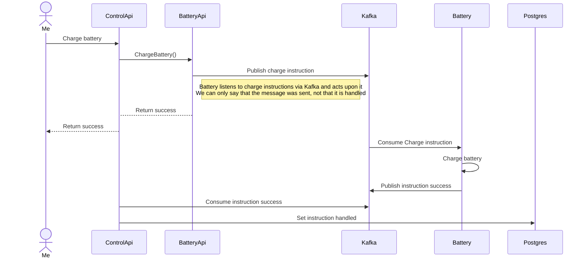
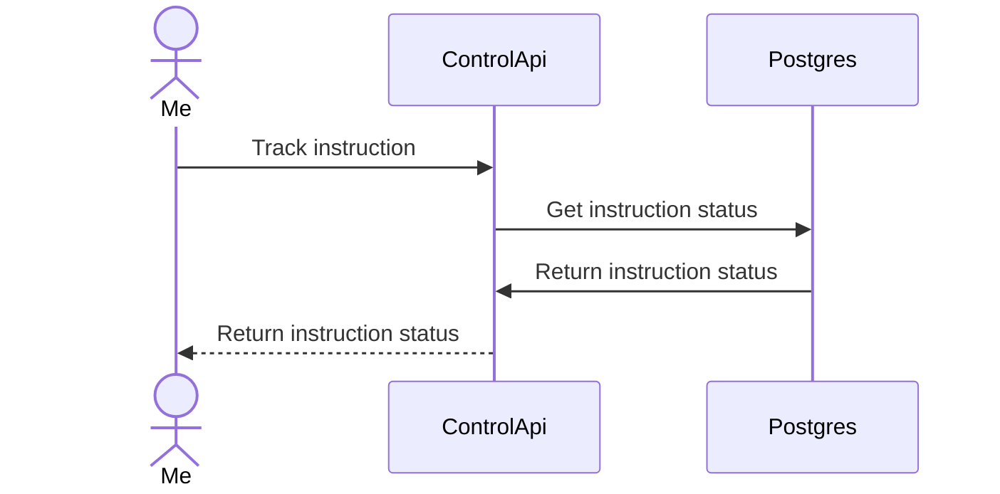

# OTEL Workshop App

## Challenges

Elke challenge bevat een omschrijving en uitklapbare vakjes, dit zijn vervolgstappen die je pas moet gaan openen als je klaar bent voor de volgende stap.

**Gebruik alleen de [control-api](apps/control-api). De andere projecten zijn er om een gedistribueerd systeem na te bootsen. Behandel deze stukken code als onderdelen die worden onderhouden door een ander software-team; jij hebt er in de praktijk dus geen toegang tot.**

### Challenge 3

#### Opdracht

Voor deze opdracht wil je gaan controleren of de instructie die je hebt gegeven ook daadwerkelijk is uitgevoerd. Je kan natuurlijk via het info endpoint status opvragen, maar het is geen garantie dat de instructie die jij gestuurd hebt ook daadwerkelijk hoort bij de status die je terugkrijgt, ondanks dat deze misschien wel hetzelfde is.

Stuur een instructie (charge of discharge); je komt erachter dat je een 'null' as id terug krijgt en dat de batterij niet reageert, terwijl je met het ID via de [status van de instructie](http://localhost:3001/api#/default/BatteryController_getStatus) gegarandeerd kan zien dat je instructie goed is afgehandeld. Nu zie je via het [info endpoint](http://localhost:3001/api#/default/BatteryController_getInfo) dat jouw instructie ook niet wordt afgehandeld. Hoe kan je nu achterhalen waar dit probleem zit?

Hier komt tracing van OpenTelemetry echt perfect van pas. Je kan namelijk zien waar de flow stopt en waar het probleem mogelijk zit.

Ga naar Grafana op het [explore tabblad](http://localhost:3000/explore), selecteer Tempo als datasource. Kies vervolgens de volgende opties:

- Service Name: `= ` `control-api`
- Tags: `span` `rootName` `=` `POST /battery/...` (waarbij ... de endpoint is die je hebt aangeroepen)
- Druk op `Run query`
- Druk op het TraceID van de meest recente trace.

Je ziet nu een waterval diagram en ziet dat deze ophoudt bij het aanroepen van de methode `charge` of `discharge`. Als je kiest voor de service name `battery-api` zie je dat de API waarnaar wij een bericht sturen ook OpenTelemetry heeft. Dat is even goed nieuws! Wat we nu kunnen doen is het toevoegen van auto instrumentation, zodat we tussen applicaties in de hele flow kunnen volgen.

**STAP 1: Werken met spans**

Voeg een `@span` decorator toe aan de `getResponse` methode in de [battery service](apps/control-api/src/app/services/battery-api.service.ts), zodat je zeker weet dat control API in ieder geval tot deze plek gekomen is. Valideer dat het werkt door een nieuwe trace te maken (de api nogmaals aanroepen).

**STAP 2: Voeg auto instrumentation toe**

Ga eerst naar de [battery-api.service.ts](apps/control-api/src/app/services/battery-api.service.ts), verwijder de niet commented code en uncomment de commented code. OpenTelemetry heeft helaas momenteel geen ondersteuning voor de fetch API van Node, waardoor we geen auto instrumentation kunnen uitoefenen om de traces aan elkaar te koppelen tussen applicaties. Daardoor gebruiken we nu even axios om dit concept wel duidelijk te maken.

Door middel van auto instrumentation worden automatisch spans gemaakt en attributen toegevoegd waardoor de volgende applicatie in de flow weet waar het vandaan komt en dus de 'traces' aan elkaar kan koppelen. Voeg auto instrumentation toe, zie onderstaande voorbeeld.

```typescript
import ki = require('opentelemetry-instrumentation-kafkajs');
import ni = require('@opentelemetry/instrumentation-nestjs-core');
import noi = require('@opentelemetry/auto-instrumentations-node');

.
withInstrumentation(
  noi.getNodeAutoInstrumentations({
    '@opentelemetry/instrumentation-fs': {
      enabled: false,
    },
  }),
  new ki.KafkaJsInstrumentation({
    enabled: true,
  }),
  new ni.NestInstrumentation({
    enabled: true,
  })
)
```

**STAP 3: Wat gaat er mis?**

Nu kan je opnieuw de traces inspecteren en zul je ergens een fout vinden. Wat is de fout? Hoe kan je dit oplossen?

#### Als je er niet uitkomt

<details>
<summary>Span toevoegen</summary>

Een span kan je toevoegen door de `@span` decorator toe te voegen aan de methode.

```typescript
import {span} from '@zonneplan/open-telemetry-node';

class MyClass {
  @span()
  async getResponse() {
    return 'response';
  }
}
```

</details>

<details>
<summary>Auto instrumentation toevoegen</summary>

Auto instrumentation kan je toevoegen in de `OpenTelemetryBuilder` in de [app.module](apps/control-api/src/main.ts). Je ziet hier ook dat er overal `require` wordt gebruikt. Dit is nodig om ervoor te zorgen dat OpenTelemetry is ingeladen voordat de applicatie start. Er zijn veel verschillende instrumentaties beschikbaar, zoals voor Express, Postgres, Kafka, etc. Zie bijvoorbeeld deze lijst: https://github.com/open-telemetry/opentelemetry-js-contrib/tree/main/plugins/node

```typescript
import otel = require('@zonneplan/open-telemetry-node');
import ki = require('opentelemetry-instrumentation-kafkajs');

new otel.OpenTelemetryBuilder('control-api')
  .withTracing((options) =>
    options
      // ...
      .withInstrumentation(
        new ki.KafkaJsInstrumentation({
          enabled: true,
        })
      )
  )
  .start();
```

</details>

### Challenge 2

#### Opdracht

Metrics zijn op verschillende manieren handig. Je wil bijvoorbeeld weten hoe lang iets duurt, om te bepalen of dat normaal is of dat er een probleem aan de hand is. Deze opdracht leert je om een Counter te gebruiken zodat je kan meten hoe vaak de 'charge' en 'discharge' endpoints worden aangeroepen.

Maak voor zowel de charge en discharge endpoints een counter aan. Tel bij elke aanroep van de endpoints de counter op. Standaard worden metrics in snake_case genoteerd.

De volgende methodes heb je nodig:

- `getOrCreateMetric`: hiermee kan je een metric aanmaken. Je IDE zal aangeven welke velden nodig zijn.
- `increment`: hiermee kan je de counter verhogen. Deze heeft een nummer nodig om te bepalen hoeveel de counter omhoog moet.

OpenTelemetry ondersteunt nog een aantal andere metric types, zoals:

- Histogram: voor het meten van de distributie van waardes
- Gauge: voor het meten van een waarde die kan veranderen, een goed voorbeeld hiervoor is het meten van het laatste tijdstip dat iets gebeurt is of de snelheid van een proces.

_Hoe kan je zien dat de counter wordt verhoogd?_

Via Prometheus kan je de metrics queryen. Dit kan je doen door:

- Navigeer naar Grafana, staat op [http://localhost:3000](http://localhost:3000)
- Kies bij de sidebar Explore [explore](http://localhost:3000/explore?schemaVersion=1&panes=%7B%22t5b%22:%7B%22datasource%22:%22prometheus_uid%22,%22queries%22:%5B%7B%22refId%22:%22A%22,%22expr%22:%22%22,%22range%22:true,%22datasource%22:%7B%22type%22:%22prometheus%22,%22uid%22:%22prometheus_uid%22%7D%7D%5D,%22range%22:%7B%22from%22:%22now-1h%22,%22to%22:%22now%22%7D%7D%7D&orgId=1)
- Selecteer `Prometheus` als datasource.
- Vervolgens kan je een query invullen, bijvoorbeeld: `instruction_status_endpoint_calls_total`. (Bij een counter wordt er altijd `_total` achter de naam gezet, dus ookal geef je dit niet aan, moet je dat wel doen hier).
- Klik op `Run query` om de query uit te voeren.
- Heb je labels toegevoegd? Dan zul je sowieso meer datapunten zien, je kan hier op filteren. Bijvoorbeeld door het volgende in te voeren: `battery_instruction_calls_total{instruction="charge"}`

**EXTRA: Zorg dat je maar een counter instantie nodig hebt voor beide status** <br>
**EXTRA: Gebruik dependency injection om de counter mee te geven**

#### Als je er niet uikomt

<details>
<summary>Counter maken</summary>

Een counter kun je aanmaken door de `getOrCreateMetric` aan te roepen. Voor een Counter zijn de volgende onderdelen nodig:

```typescript
const myCounter = getOrCreateMetric({
  type: 'Counter',
  valueType: ValueType.INT,
  description: 'Number of times the instruction status endpoint was called',
  name: 'instruction_status_endpoint_calls',
});
```

</details>
<details>
<summary>Increment op een counter</summary>

Een counter kan je verhogen door de `increment` methode aan te roepen. Deze heeft een nummer nodig om te bepalen hoeveel de counter omhoog moet.

```typescript
myCounter.increment(1);
```

</details>

<details>
<summary>Dependency injection</summary>

Je kan de counter meegeven aan de class (bijvoorbeeld de controller) door hem in de constructor mee te geven en te decoraten met de `@injectMetric` decorator. Vervolgens moet je deze dan ook meegeven in de `provide` array van de module.

Bij voorkeur maak je een constante aan voor de naam van de provider, zodat je bij een wijziging van de naam niet overal in de code hoeft te zoeken naar de juiste naam. (bijvoorbeeld: `const MY_COUNTER_NAME='instruction_status_endpoint_calls'`)

**De class**

```typescript
import {injectMetric} from '@zonneplan/open-telemetry-nest';

@Injectable()
export class BatteryService {
  constructor(@injectMetric('instruction_status_endpoint_calls') private readonly myCounter: Counter) {
  }
}
```

**De [app.module](apps/control-api/src/app/app.module.ts)**

```typescript


@Module({
  imports: [MetricsModule],
  providers: [
    {
      createCounterProvider({
                              valueType: ValueType.INT,
                              description: 'Number of times the instruction status endpoint was called',
                              name: 'instruction_status_endpoint_calls',
                            })
    }
  ],
})
export class BatteryModule {
}
```

</details>

### Challenge 1

#### Opdracht

Je wilt de batterij gaan opladen. Dit kan je doen door de [charge endpoint](http://localhost:3001/api#/default/BatteryController_charge) aan te roepen.
Vervolgens verwacht je dat de batterij gaat laden. Dit kan je controleren door het [battery info endpoint](http://localhost:3001/api#/default/BatteryController_getInfo) aan te roepen.

<details>
<summary>Wat zie je?</summary>
Er komt geen batterij informatie door. Hoe kan je via logs inzichtelijk maken wat er mis gaat? Welk log level zou je hiervoor gaan gebruiken?
</details>

#### Als je er niet uitkomt

<details>
<summary>Een logger toevoegen aan de dependency injection</summary>
Het is voor deze challenge het makkelijkste om de `@zonneplan/open-telemetry-zonneplan` log package te gebruiken, zodat je straks ook makkelijk logs inzichtelijk krijgt in grafana.

In de [app.module](apps/control-api/src/app/app.module.ts) kan je de `LoggerModule` toevoegen aan de imports. Hiermee kan je de `LoggerService` injecten in de `BatteryService`, waardoor de `BatteryService` een dependency wordt.

<details>
<summary>Code voorbeeld LoggerModule</summary>

```typescript
import {LoggerModule} from '@zonneplan/open-telemetry-zonneplan';

@Module({
  imports: [LoggerModule],
})
export class AppModule {
}
```

</details>

<details>
<summary>Code voorbeeld LoggerService</summary>

```typescript
import {LoggerService} from '@zonneplan/open-telemetry-zonneplan';

@Injectable()
export class BatteryService {
  constructor(private readonly logger: LoggerService) {
  }
}
```

</details>
<br>
</details>

<details>
<summary>Duidelijk maken van welke plek een log bericht komt</summary>
In de constructor van een class kan je een context zetten via `myService.setContext('my-context')` zodat je weet op welke plek de log precies wordt aangeroepen.
</details>

<details>
<summary>Een log bericht plaatsen</summary>

Zie de mogelijke methods van de [LoggerService](node_modules/@zonneplan/open-telemetry-nest/dist/src/logging/services/logger.service.d.ts) en kies de juiste voor jouw situatie.

</details>

## Setup

1. Run `npm install` to install all dependencies
2. Run the docker-compose by running: `docker-compose -p otel-workshop -f docker/docker-compose.yml up -d`
3. Prepare the database: `npm run db:prepare`
4. Run all apps: `npm run all`
5. Go to the API: [http://localhost:3001/api](http://localhost:3001/api)

## Application flows

**Get battery info**



**Dis(charge) battery**



**Track instruction**


