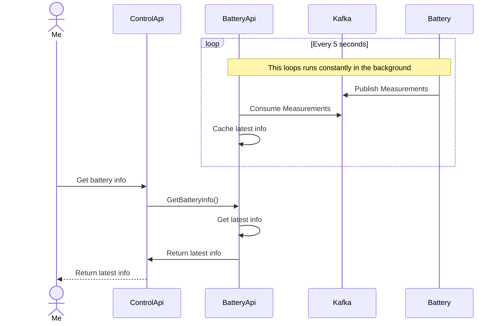
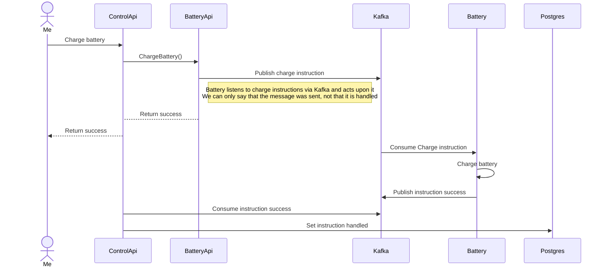
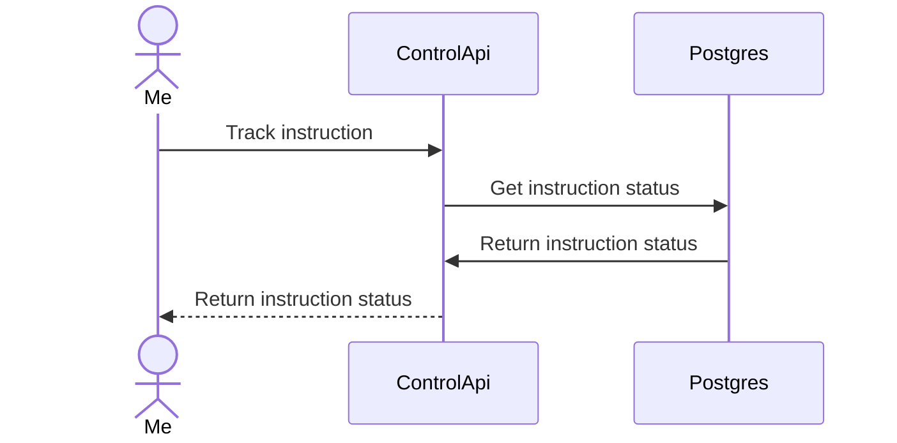

# OTEL Workshop App

## Challenges

Elke challenge bevat een omschrijving en uitklapbare vakjes, dit zijn vervolgstappen die je pas moet gaan openen als je klaar bent voor de volgende stap.

**Gebruik alleen de [control-api](apps/control-api). De andere projecten zijn er om een gedistribueerd systeem na te bootsen. Behandel deze stukken code als onderdelen die worden onderhouden door een ander software-team; jij hebt er in de praktijk dus geen toegang tot.**

### Challenge 1

#### Opdracht

Je wilt de batterij gaan opladen. Dit kan je doen door de [charge endpoint](http://localhost:3001/api#/default/BatteryController_charge) aan te roepen.
Vervolgens verwacht je dat de batterij gaat laden. Dit kan je controleren door het [battery info endpoint](http://localhost:3001/api#/default/BatteryController_getInfo) aan te roepen.

<details>
<summary>Wat zie je?</summary>
Er komt geen batterij informatie door. Hoe kan je via logs inzichtelijk maken wat er mis gaat? Welk log level zou je hiervoor gaan gebruiken?
</details>

#### Als je er niet uitkomt

<details>
<summary>Een logger toevoegen aan de dependency injection</summary>
Het is voor deze challenge het makkelijkste om de `@zonneplan/open-telemetry-zonneplan` log package te gebruiken, zodat je straks ook makkelijk logs inzichtelijk krijgt in grafana.

In de [app.module](apps/control-api/src/app/app.module.ts) kan je de `LoggerModule` toevoegen aan de imports. Hiermee kan je de `LoggerService` injecten in de `BatteryService`, waardoor de `BatteryService` een dependency wordt.

<details>
<summary>Code voorbeeld LoggerModule</summary>

```typescript
import {LoggerModule} from '@zonneplan/open-telemetry-zonneplan';

@Module({
  imports: [LoggerModule],
})
export class AppModule {
}
```

</details>

<details>
<summary>Code voorbeeld LoggerService</summary>

```typescript
import {LoggerService} from '@zonneplan/open-telemetry-zonneplan';

@Injectable()
export class BatteryService {
  constructor(private readonly logger: LoggerService) {
  }
}
```

</details>
<br>
</details>

<details>
<summary>Duidelijk maken van welke plek een log bericht komt</summary>
In de constructor van een class kan je een context zetten via `myService.setContext('my-context')` zodat je weet op welke plek de log precies wordt aangeroepen.
</details>

<details>
<summary>Een log bericht plaatsen</summary>

Zie de mogelijke methods van de [LoggerService](node_modules/@zonneplan/open-telemetry-nest/dist/src/logging/services/logger.service.d.ts) en kies de juiste voor jouw situatie.

</details>

## Setup

1. Run `npm install` to install all dependencies
2. Run the docker-compose by running: `docker-compose -p otel-workshop -f docker/docker-compose.yml up -d`
3. Prepare the database: `npm run db:prepare`
4. Run all apps: `npm run all`
5. Go to the API: [http://localhost:3001/api](http://localhost:3001/api)

## Application flows

**Get battery info**



**Dis(charge) battery**



**Track instruction**


